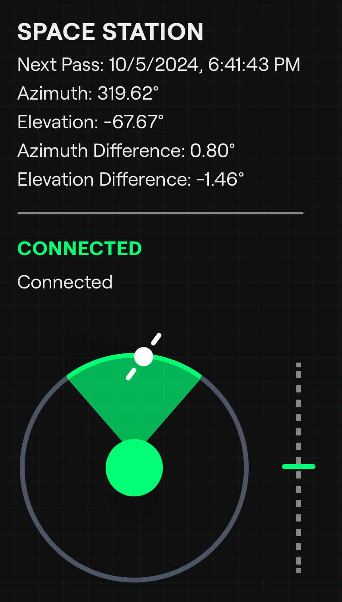

# **STAR - Satellite Tracking and Alignment Resource**


**STAR** is a web interface that helps users align their device (and antenna) with a specified satellite using the device's motion sensors and real-time Two-Line Element (TLE) data. Designed for both beginners and advanced users, STAR simplifies satellite alignment for handheld antennas, particularly useful for HAM radio operators and satellite enthusiasts.

[](https://vercel.com/new/clone?repository-url=https%3A%2F%2Fgithub.com%2FConorEB%2Fstar&env=N2YO_API_KEY&envDescription=API%20key%20needed%20to%20fetch%20TLE%20data%20for%20the%20satellite&envLink=https%3A%2F%2Fwww.n2yo.com%2Flogin%2Fregister%2F&demo-title=STAR&demo-description=A%20easy%20to%20use%20web%20app%20to%20align%20your%20antenna%20with%20any%20satellite%20using%20your%20phone's%20motion%20sensors%20and%20location.&demo-url=https%3A%2F%2Fstar.conor.link&demo-image=https%3A%2F%2Fstar.conor.link%2Fimages%2FdemoUI.png)

## **Tech Stack**

- **Next.js** 15.1.0
- **React** 18
- **TypeScript**
- **Tailwind CSS**
- **N2YO API** for satellite data retrieval


## **Getting Started**

### **1. Prerequisites**

Before you begin, ensure you have the following:
- Node.js (v18+)
- Yarn or npm
- [N2YO API Key](https://www.n2yo.com/login/register/) (to fetch satellite TLE data)

### **2. Setup the Project**

1. Clone the repository:
   ```bash
   git clone https://github.com/ConorEB/star
   cd star
   ```

2. Install dependencies:
   ```bash
   yarn install
   ```

### **3. Environment Variables**

Include your N2YO API key in the `.env` file in the project's root directory:
```bash
N2YO_API_KEY={INSERT_API_KEY}
```

You can obtain an API key from N2YO (https://www.n2yo.com/login/register). Make sure to replace INSERT_API_KEY with your actual key.

### **4. Local Development**

Start the development server:
```bash
yarn dev
```

Once running, open http://localhost:3000 in your browser to view the application.

This app only works on devices that supply motion data via the web API, which are typically only mobile devices. I reccomend using [ngrok](https://ngrok.com/) to establish a tunnel to a local device if you are running this on a computer.

## **Demo**

<p float="left">
  
   
</p>

---

## **Authors**

- [@ConorEB](https://github.com/ConorEB)

---

## **License**

This project is released under the MIT License. Refer to the LICENSE file for more information.